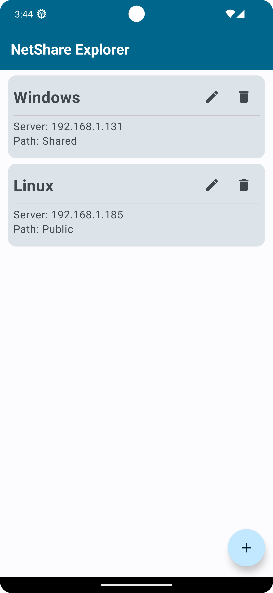

# NetShare Explorer

Unlock seamless and convenient access to your shared files within your local network using NetShare Explorer, an Android app designed to streamline your file management experience. With NetShare Explorer, you can effortlessly connect to and explore files stored on various devices within your local network via the Samba protocol.

NetShare Explorer provides a simple and intuitive interface to effortlessly integrate your Android device with devices connected to your local network. Seamlessly access files from your desktop, laptop, NAS (Network Attached Storage), and more.

## Configure the access to your shared files

Keep your files safe with NetShare Explorer's secure authentication process. Log in using your network credentials to ensure that only authorized users can access shared resources.

## List your configurations

List your connected shared storage and access them easily from the list of configurations.

## Navigate through your files

Navigate through your shared files and directories with ease. NetShare Explorer offers a familiar file browsing experience, allowing you to effortlessly find the documents, photos, videos, and other content you need.

## Access your files using your device's apps

Access your files directly from the app. NetShare Explorer empowers you to manage your files efficiently without needing to be physically present at your computer.

